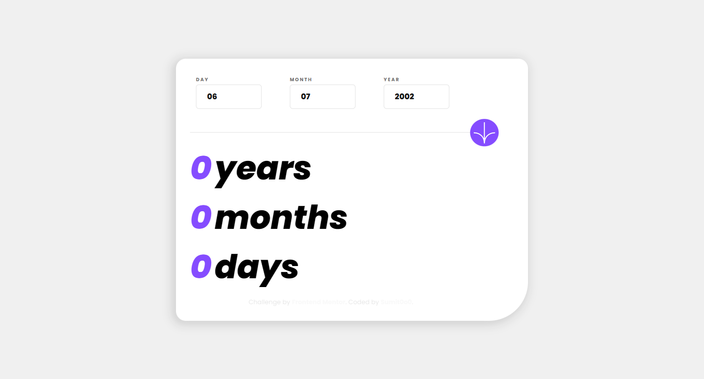
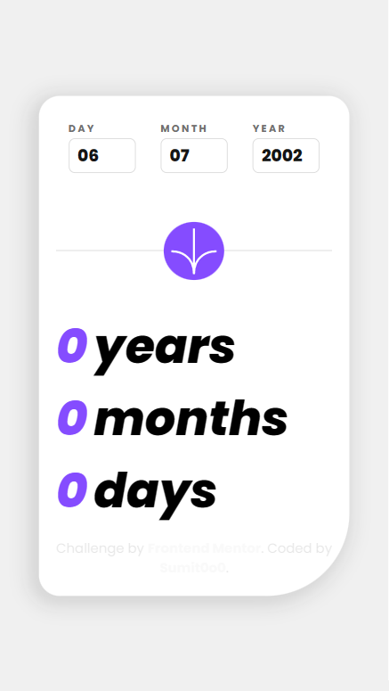

# Frontend Mentor - Age calculator app solution

This is a solution to the [Age calculator app challenge on Frontend Mentor](https://www.frontendmentor.io/challenges/age-calculator-app-dF9DFFpj-Q). Frontend Mentor challenges help you improve your coding skills by building realistic projects. 

## Table of contents

- [Overview](#overview)
  - [Screenshot](#screenshot)
  - [Links](#links)
- [My process](#my-process)
  - [Built with](#built-with)
  - [What I learned](#what-i-learned)
  - [Useful resources](#useful-resources)

## Overview

### Screenshot
-Desktop Preview

-Mobile Preview

### Links

- Solution URL: [Add solution URL here](https://your-solution-url.com)
- Live Site URL: [Add live site URL here](https://your-live-site-url.com)

## My process

### Built with

- Semantic HTML5 markup
- CSS custom properties
- Flexbox
- Mobile-first workflow
- [Jquery](https://jquery.com/) - JS library

### What I learned

I learned how to implement jQuery with JavaScript, which helped me code faster. My JavaScript code is lengthy and more complicated, but I am satisfied with it for now. However, I know that JavaScript code can be made less lengthy.

### Useful resources

- [Jquery](https://jquery.com/) - The jQuery documentation helped me a lot when I was stuck somewhere.
